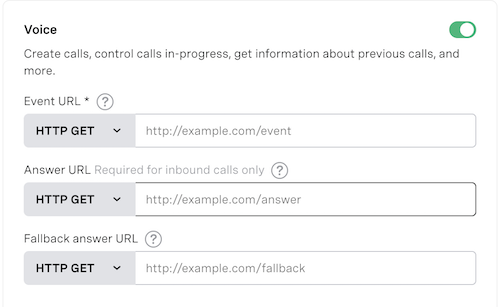

# Vonage 5 Minute Demo: Create and Answer Voice Calls With Ruby

[](CODE_OF_CONDUCT.md)
[](./LICENSE.txt)


This is a demo app showcasing how to get up and running with the Vonage Voice API in Ruby.

Users can call the application, which will then save their phone number. The application can then be used to randomly select a caller and call them back informing them they were selected.

* [Requirements](#requirements)
* [Installation](#installation)
* [Usage](#usage)
* [License](#license)

## Requirements

This app requires Ruby v2.7 or greater and the following gems:

* [Vonage](https://github.com/vonage/vonage-ruby-sdk)
* [Sinatra](https://github.com/sinatra/sinatra)
* [Sinatra-Contrib](https://github.com/sinatra/sinatra/tree/master/sinatra-contrib)
* [Sinatra-Activerecord](https://github.com/sinatra-activerecord/sinatra-activerecord)
* [pg](https://rubygems.org/gems/pg/versions/0.18.4)
* [rake](https://github.com/ruby/rake)
* [json](https://github.com/flori/json)

These are all included in the project's `Gemfile` and will be installed when you run `bundle install` from the command line.

## Installation

Once you clone the repository, make sure its dependencies are installed on your local machine:

```bash
$ bundle install
```

Then you will want to create the PostgreSQL database by first running `bundle exec rake db:load_config` and then `bundle exec rake db:migrate`.

## Usage

This application requires a Vonage provisioned virtual number that is linked to a Voice Voice application. Both of those items can be created from your [Vonage Dashboard](https://dashboard.nexmo.com). The phone number you create in the Dashboard will be the number that you will call to use your application.

You will need to provide an `answer URL` for the application you create that corresponds to the answer route provided in the `app.rb` file. The answer URL needs to be an externally accessible URL that ends with `/webhooks/answer`. For example, if your URL was `example.com`, then your answer URL would be `http://example.com/webhooks/answer`.



Next, open up the `app.rb` file in your preferred code editor and both your Vonage application ID and your Vonage phone number to the constants defined in the file:

```ruby
VONAGE_APPLICATION_ID = ''
VONAGE_NUMBER = ''
```

Make sure to also add your Vonage API key and your Vonage API secret to your `.env` file. You can rename the `.env.sample` file provided in this repository to `.env` and fill in the values there. 

Lastly, make sure to generate a public and private key in your Vonage API Dashboard for your application and save the private key to the root folder of this project. Do not forget to also press the `Save` button in the dashboard to ensure that the key has been stored successfully for your account.

Once that is completed you can run the application by executing the following command:

```bash
$ bundle exec ruby app.rb
```

The above command will begin a web server running on port 3000.

The application is now ready to call.

When you are ready to select a winner you can visit `http://localhost:3000/winner` and the application will choose one caller at random and call them.

## License

This library is released under the [MIT License][license]

[license]: LICENSE.txt
